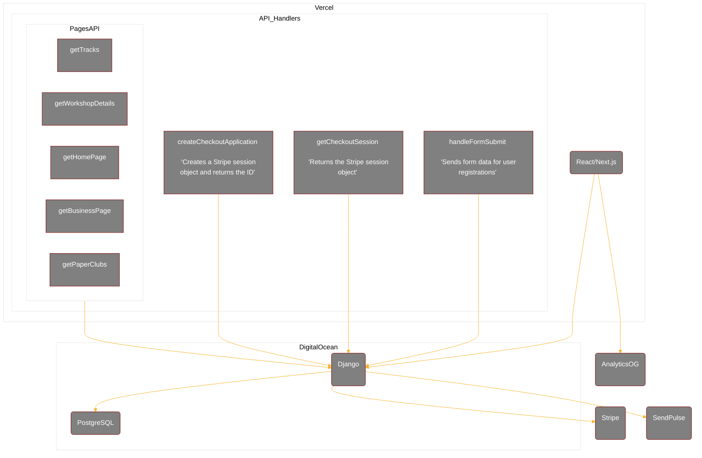

# Global architecture

```mermaid

```

```mermaid
%%{
  init: {
    'theme': 'base',
    'themeVariables': {
      'primaryColor': 'grey',
      'primaryTextColor': '#fff',
      'primaryBorderColor': '#7C0000',
      'lineColor': '#F8B229',
      'secondaryColor': '#006100',
      'tertiaryColor': '#fff'
    }
  }
}%%

graph TB

  subgraph Vercel
    React(React/Next.js)
    subgraph API_Handlers
      createCheckoutApplication[createCheckoutApplication <br><br> 'Creates a Stripe session object and returns the ID' <br><br>]
      getCheckoutSession[getCheckoutSession <br><br> 'Returns the Stripe session object' <br><br>]
      handleFormSubmit[handleFormSubmit <br><br> 'Sends form data for user registrations' <br><br>]
      subgraph PagesAPI
        getTracks[getTracks <br><br>]
        getWorkshopDetails[getWorkshopDetails <br><br>]
        getHomePage[getHomePage <br><br>]
        getBusinessPage[getBusinessPage <br><br>]
        getPaperClubs[getPaperClubs <br><br>]
      end
    end
  end

  subgraph DigitalOcean
    Django(Django <br><br>)
    PostgreSQL(PostgreSQL <br>)
  end

  Stripe(Stripe <br><br>)
  SendPulse(SendPulse <br><br>)
  AnalyticsOG(AnalyticsOG <br><br>)

  React --> Django
  Django --> PostgreSQL

  PagesAPI --> Django

  createCheckoutApplication --> Django --> Stripe
  getCheckoutSession --> Django

  handleFormSubmit --> Django --> SendPulse

  React --> AnalyticsOG
```