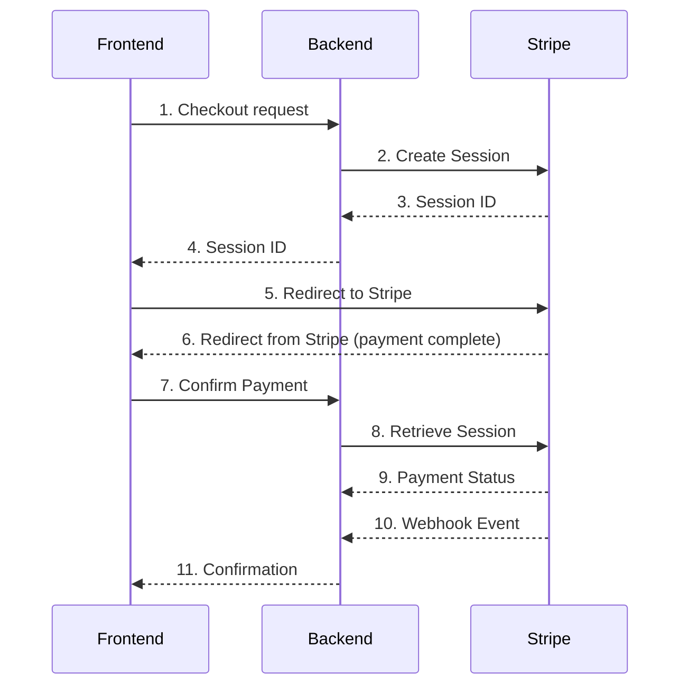

# Stripe

Here is description how Stripe interact with BE and FE

1. **Frontend** sends a checkout request to the **Backend** with the necessary data (product or service details, user information, etc.).
2. **Backend** receives this request and creates a Checkout Session using the Stripe API. This action includes sending information about what is being purchased and providing `success_url` and `cancel_url` endpoints for redirect after payment. The Stripe API returns a session ID.
3. **Backend** sends the session ID back to the **Frontend**.
4. **Frontend** receives this session ID and redirects the user to the Stripe-hosted checkout page using Stripe's JavaScript library (typically using the `redirectToCheckout` method).
5. User completes the payment process on the Stripe-hosted checkout page.
6. Once the payment process is completed, **Stripe** redirects the user to the `success_url` or `cancel_url` provided earlier, based on whether the payment was successful or not. The Checkout Session ID is included in this redirect URL.
7. **Frontend** receives this redirect, and from the URL, it extracts the Checkout Session ID.
8. **Frontend** sends a request to the **Backend** with the Checkout Session ID to confirm the payment.
9. **Backend** uses the Checkout Session ID to retrieve the session details from Stripe, confirming whether the payment was successful.
10. Meanwhile, **Stripe** sends a webhook event to the **Backend** to notify about the status of the payment. The **Backend** updates the order status based on this webhook data.
11. **Backend** sends a response back to the **Frontend** with the result of the payment confirmation.
12. **Frontend** receives this confirmation and updates the UI accordingly, informing the user of the result of the transaction.

This is a typical sequence for Stripe interaction with a web application, though the specifics can vary based on the needs of your application.

Here is diagram of interaction.

Here's a description of the steps to help you draw the sequence diagram:

1. Frontend sends a checkout request to Backend.
2. Backend makes a Create Session request to Stripe.
3. Stripe returns a Session ID to Backend.
4. Backend returns the Session ID to Frontend.
5. Frontend redirects user to Stripe's payment page.
6. User completes payment and is redirected back to Frontend.
7. Frontend sends Confirm Payment request to Backend.
8. Backend makes Retrieve Session request to Stripe.
9. Stripe returns Payment Status to Backend.
10. Stripe sends a webhook event to Backend.
11. Backend sends Confirmation to Frontend.

Please use any sequence diagram tool you like (for example, [draw.io](http://draw.io/), Lucidchart, PlantUML, etc.) to draw this sequence based on the textual representation above.

[For admin](For%20admin%201549da3446e241a8be0433e97896179f.md)